# www_lab_week7
+Admin

--------------Customer--------------

1.Danh sách customer:
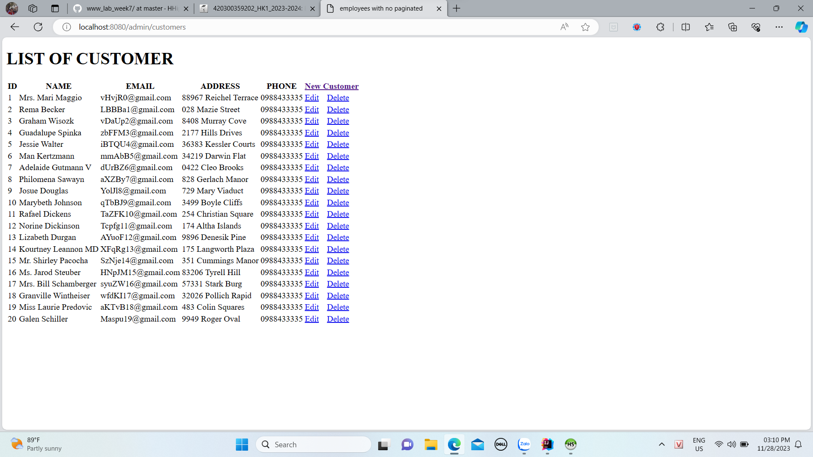
2.Add new Customer:
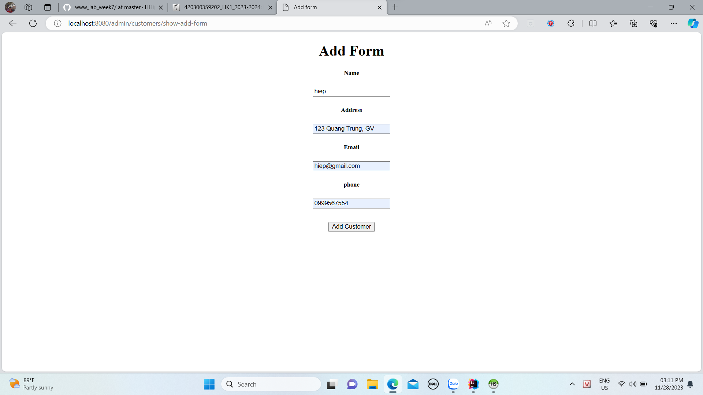
3.Sau khi add:

4.Edit customer(edit name):
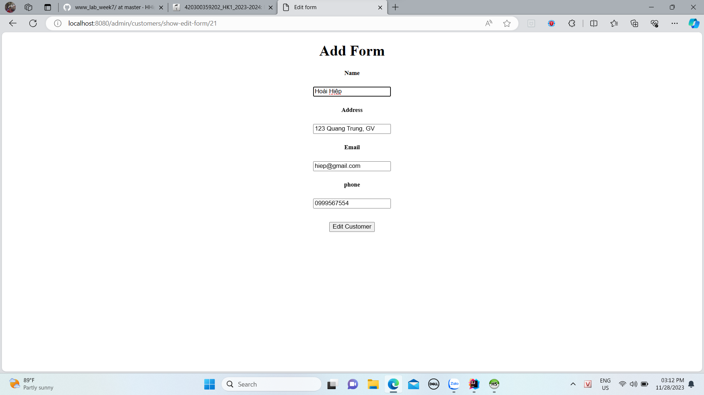
5.Sau khi edit:
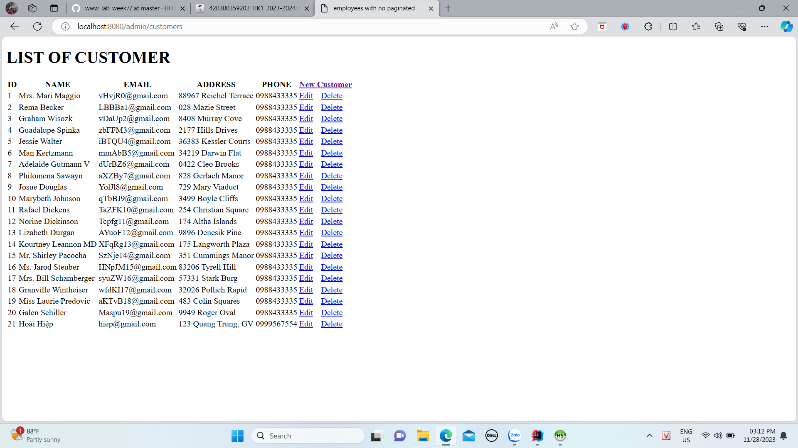
6.Delete Customer(id=21):

7.Sau khi delete:
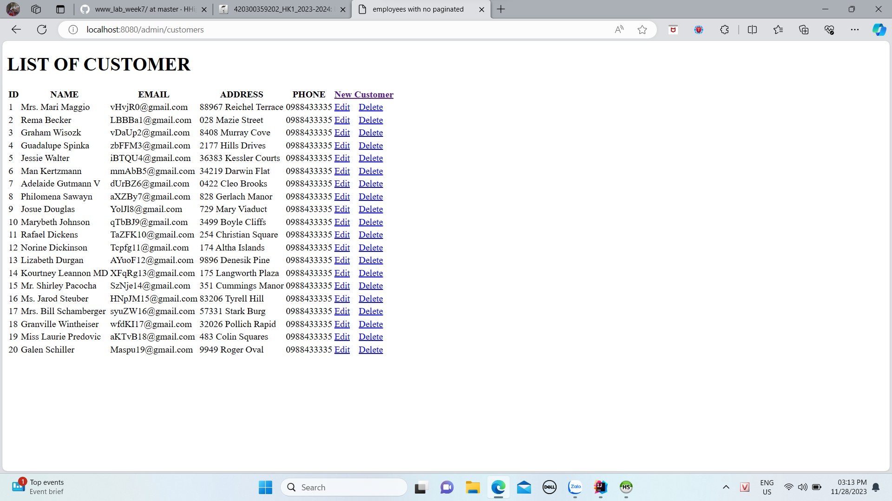
--------------Employee--------------

1.Danh sách Employee:

2.Add new Employee:
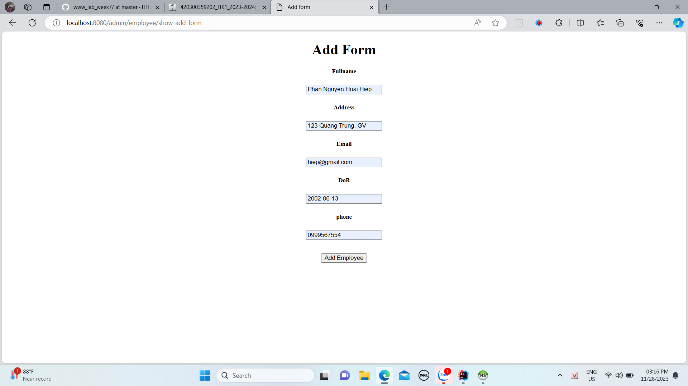
3.Sau khi add:
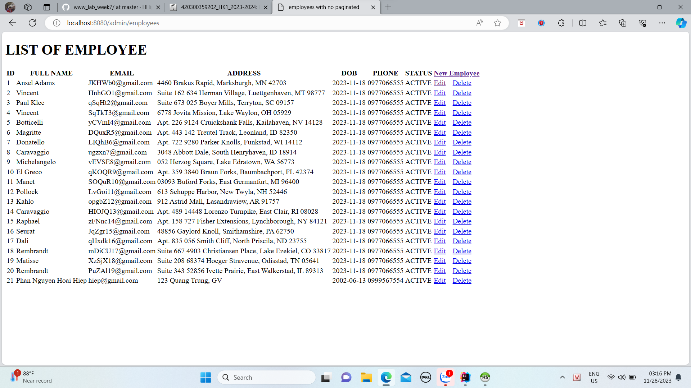
4.Edit employee(edit name):
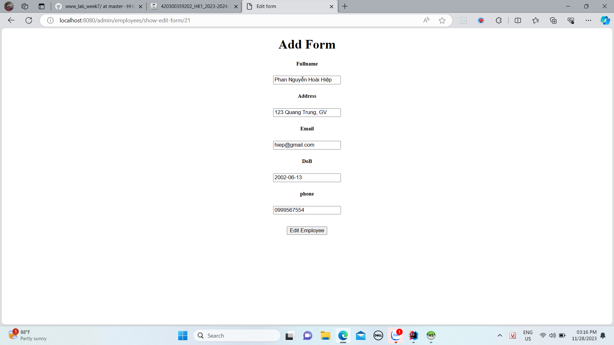
5.Sau khi edit:

6.Delete employee(id=21):
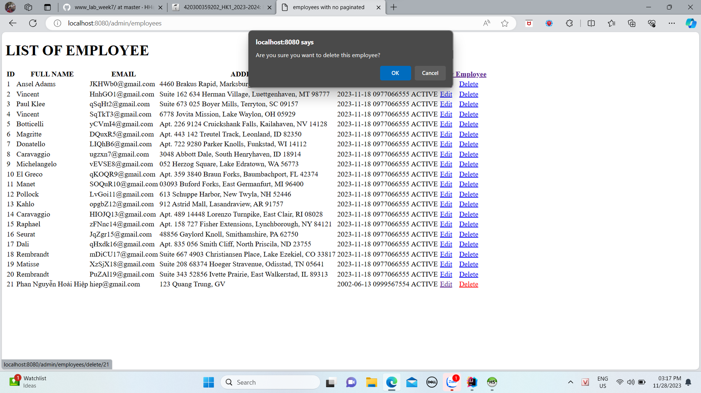
7.Sau khi delete:
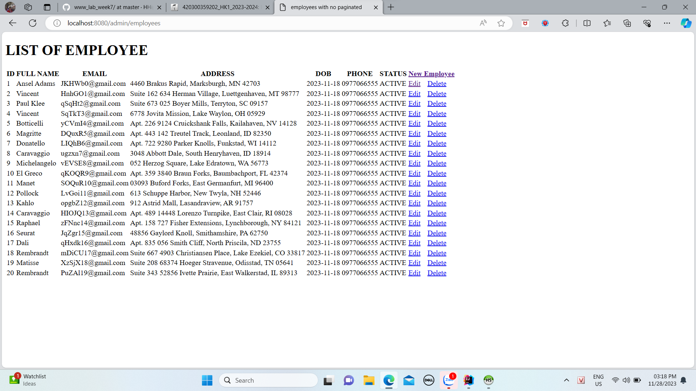

--------------Product--------------

1.Danh sách product(no paging:
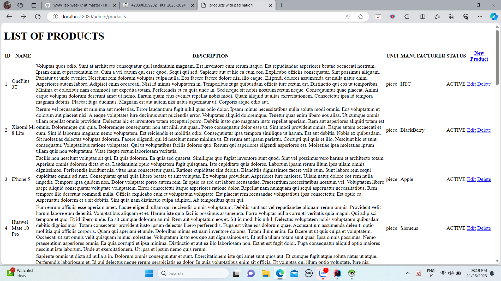
2.Danh sách product(with paging):
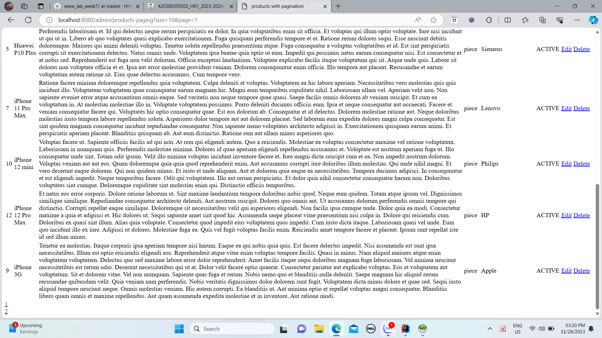

+Client

1.Shopping:
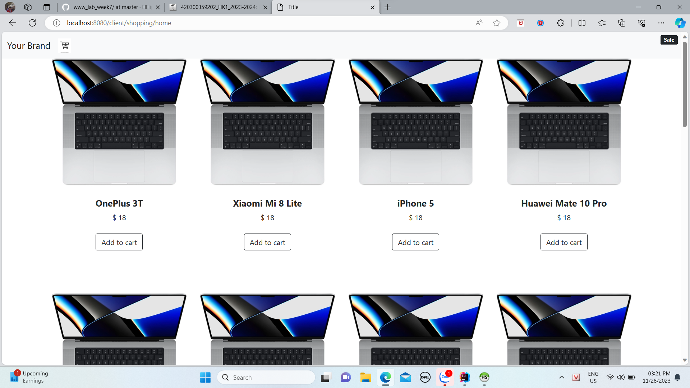
2.Add2Cart: